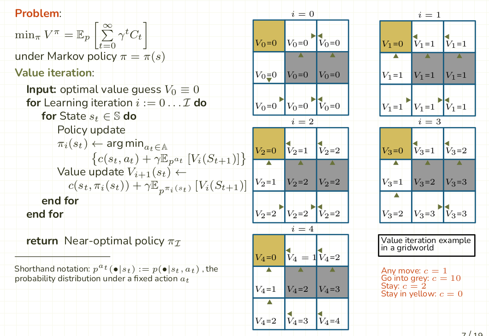

# Grid Example
This short programm is based on an example from the reinforcement learning course. It finds the shortest path in a 3x3 grid world based on q-learning. We also created a hand written [pdf](qlearning_by_hand.pdf) showing the first iteration step-by-step and the q-table for the other iterations.

### Run
```bash
python gridExample.py
```

<div>
    
</div>
Q-learning algorithm and enviorment
