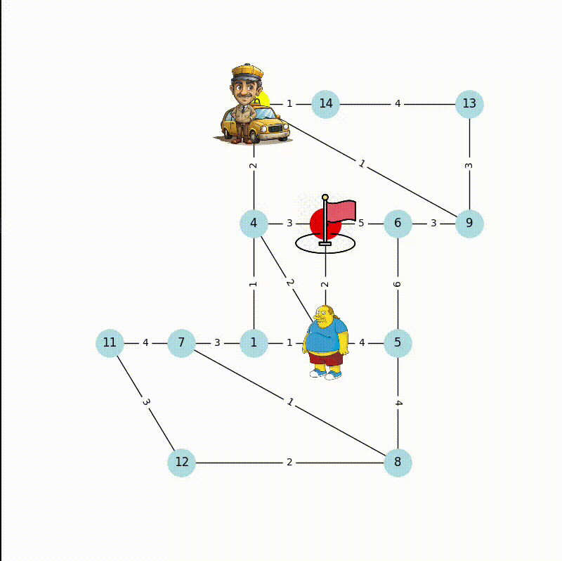

# Mini-Project Tabular - Crazy Taxi
This project is the first mini-project for the reinforcement learning course. It simulates a taxi-driving-system. The taxi drivers goal is to get a passenger and deliver him/her to his/hers destination. It's realised as a graph problem, so the goal is to find the shortest path. To find the shortest path we used Q-Learning. 

### Setup
```bash
pip install -r requirements.txt
```

### Train

#### Configuration:
- `EPISODES`: The number of episodes to train the agent. Default: 100000
- `VISU_EPISODE`: The interval at which training progress is visualized (if visualization is enabled). Default: EPISODES / 10
- `SAVE_Q_TABLE`: Whether to save the Q-Table after training. Default: True
- `SAVE_Q_TABLE_PATH`: The path to save the Q-Table. Default: q_tables/qt_{EPISODES}.txt
- `VISUALIZE_TRAINING`: Enable/disable visualization of the training process. Default: False
- `PLOT`: Enable/disable plotting of training metrics. Default: False

```bash
python train_crazy_taxi.py
```

### Run
#### Configuration:
- `Q_TABLE_PATH`: The path to the pre-trained Q-Table used for running the simulation. Default: q_tables/qt_100000.txt
- `ITERATIONS`: The number of iterations the simulation will run. Default: 10

```bash
python run_crazy_taxi.py
```

#### Results


This is one example result for the first mini-project
<div>
    
    
</div>
To see some more results run the code. There are some more visualizations included.